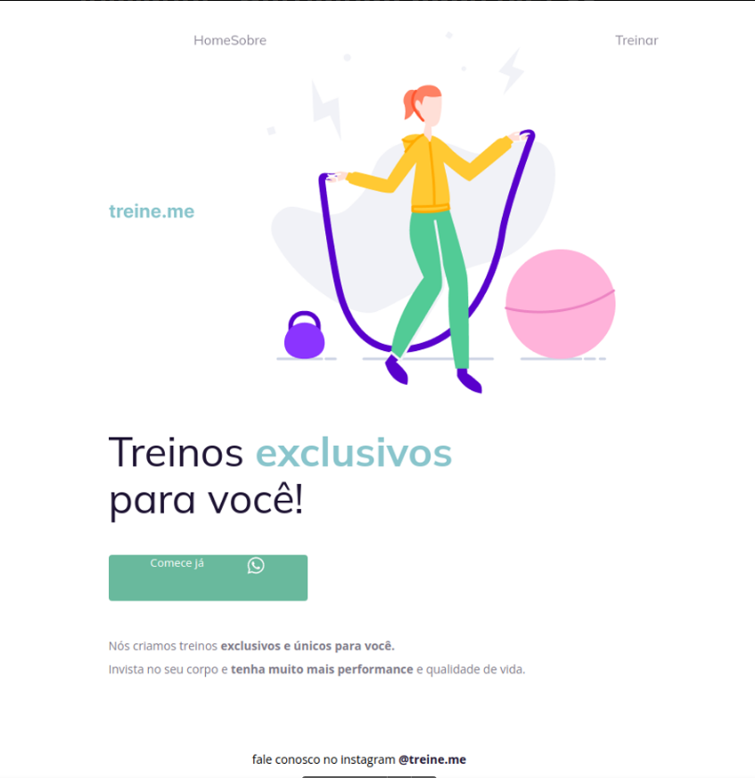
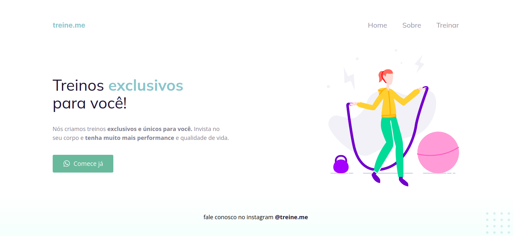

# Treine-me 

Resolução desafio projeto treine-me.

O desafio consistia em ajustar a página, que estava assim:

  

Para ela ficar assim:

  

Esse projeto foi desenvolvido com as seguintes tecnologias:

- HTML e CSS
- Git e Github
- Figma

